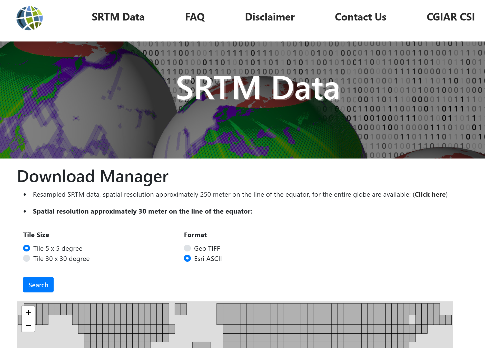
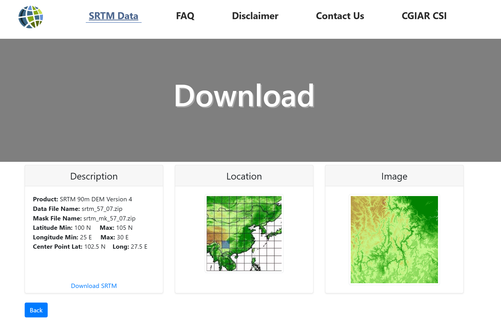

# Source

# Download Steps

1. Open the [link to SRTM90 download page](https://srtm.csi.cgiar.org/srtmdata/)
   
2. choose Tile 5x5 or 30x30 degree block, `GeoTIFF` format, then click on blocks in map to select
3. click search to list results
   
4. click `Download SRTM` to download data of this block, save it into `.../SeisTools.jl/external/Topography/SRTM90/raw_data`

# Reference
